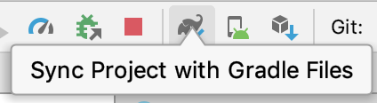

# Williams-Mobile

## Before starting

1. [Download Homebrew](https://brew.sh)

2. [Download node](https://nodejs.org/en/)

3. [Setup React Native](https://facebook.github.io/react-native/docs/getting-started) and follow the instructions under **React Native CLI Quickstart**

4. Get the latest version of ruby using [rbenv](https://github.com/rbenv/rbenv#homebrew-on-macos)

## After cloning the repo

```
cd Williams-Mobile
yarn install
```

### For Android

• Download Android Studio and open the android root directory

• Click on the SDK Manager and download these packages


• Sync files



### For iOS

Navigate into the iOS root directory : `cd ios`

Run `pod install`

## Useful commands to know.

### Running the application via terminal:

• Start the React Packager:

From the root directory, run:

`react-native start`

Then either one of:

`react-native run-android`

`react-native run-ios`

### Running the application with Xcode

• Download the latest version of Xcode

• Open ios/WilliamsMobile.xcworkspace in Xcode

• Pick a simulator


• Run the application using the play button

### Running the application with Android Studio

• Sync files


• Pick or create a virtual device to run the application on


• Press the play button


### Troubleshooting:

- "Could not get BatchedBridge, make sure your bundle is packaged correctly"
  - [Solution](https://medium.com/@adityasingh_32512/solved-unable-to-load-script-from-assets-index-android-bundle-bdc5e3a3d5ff)
- If you can't run `pod install` make sure your Ruby is on the latest version and that cocoapods are installed (`sudo gem install cocoapods`)
- If not all of your android modules are loading into Android Studio, `cd android` from the root directory and run `./gradlew clean`. This will delete the `build` folder and make sure that no previous code or resources are still being cached.

